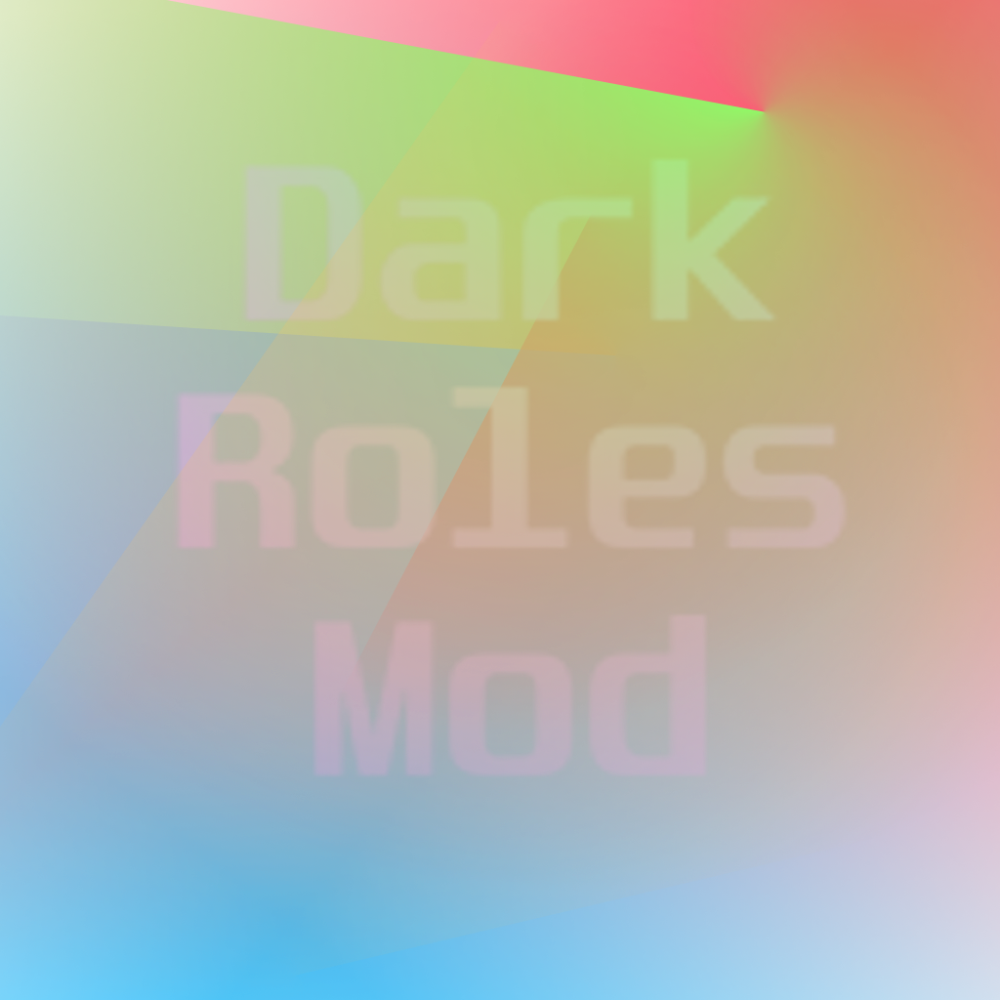

<h1 align="center">$\mathbb{\color{#C092C0}{Dark \ Roles } \ {Reloaded }}$</h1>

 
  

  <pre>
    
 ## Regarding this mod

This mod is not affiliated with Among Us or Innersloth LLC, 
and the content contained therein is not endorsed or 
otherwise sponsored by Innersloth LLC. Portions of 
the materials contained herein are property of 
Innersloth LLC. © Innersloth LLC.

  ## Regarding this mod

  Town Of Host Extreme mod has support for among us 
  versions 2023.10.* and 2023.11.* 

  
  </pre>

 
<pre>
  
## **Credits:**
###  ⭐ [Town Of Host](https://github.com/tukasa0001/TownOfHost) :
 - Our repo is based on Town Of Host

### ⭐ [Town Of Host: Enhanced](https://github.com/0xDrMoe/TownofHost-Enhanced) :
 - Main menu stuff
 - Discord RPC
 - NameNotifyManager
 - Zoom (originally from TOP?)
 - RPC Teleport methods
 - /r command
</pre>

